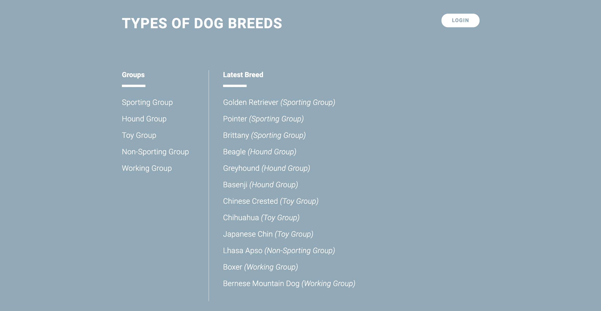

# Types of Dog Breed Catalog
This catalog is focused on dog breed types. User after login can create new breeds under each dog types.

----

### About this Item Catalog

The Item Catalog project consists of developing an application that provides a list of items within a variety of categories, as well as provide a user registration and authentication system.

This program uses third-party auth with Google or Facebook. Some of the technologies used to build this application include Flask, Bootsrap, Jinja2, and SQLite.

----

## Set Up

1. Clone the [fullstack-nanodegree-vm repository](https://github.com/udacity/fullstack-nanodegree-vm).

2. Look for the *catalog* folder and replace it with the contents of this respository.

## Usage

Launch the Vagrant VM from inside the *vagrant* folder with:

`vagrant up`

Then access the shell with:

`vagrant ssh`

Then move inside the catalog folder:

`cd /vagrant/catalog`

Then run the application:

`python application.py`

After the last command you are able to browse the application at this URL:

`http://localhost:5000/`

------

###Skills used for this project
Python
HTML
CSS
Bootstrap
Flask
Jinja2
SQLAchemy
OAuth
Facebook / Google Login

----

